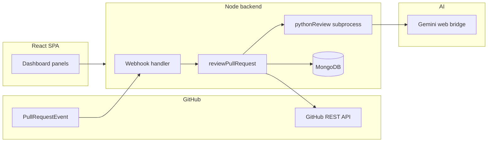

# Final Year Project (PFE) Report — Chapters 1 & 2

**Title:** [Insert official project title]  
**Author:** [Your full name]  
**Supervisor:** [Supervisor name and title]  
**Institution:** [University / school name]  
**Program / degree:** [Official degree name, e.g. Computer Science — Engineering]  
**Academic year / date:** [e.g. 2025–2026]

---

## Table of Contents

| Section | Page |
|---------|------|
| Title page | [p. …] |
| Abstract | [p. …] |
| Table of Contents | [p. …] |
| List of Figures | [p. …] |
| List of Tables | [p. …] |
| **Chapter 1 Introduction** | [p. …] |
| 1.1 Context and motivation | [p. …] |
| 1.2 Problem statement | [p. …] |
| 1.3 Proposed solution | [p. …] |
| 1.4 Objectives | [p. …] |
| 1.5 Scope and limitations | [p. …] |
| 1.6 Methodology | [p. …] |
| 1.7 Structure of this report | [p. …] |
| **Chapter 2 State of the art and conceptual framework** | [p. …] |
| 2.1 Pull requests and collaborative development | [p. …] |
| 2.2 Human code review and its limits | [p. …] |
| 2.3 Automated analysis and tooling | [p. …] |
| 2.4 GitHub Apps, webhooks, and multi-tenant integrations | [p. …] |
| 2.5 Large language models in code review | [p. …] |
| 2.6 Related systems and positioning | [p. …] |
| 2.7 Summary and link to the proposed architecture | [p. …] |
| References | [p. …] |

*When converting to Word: replace `[p. …]` with actual page numbers after pagination; use Heading 1/2 styles and update the TOC field.*

---

## List of Figures

| Figure | Title | Page |
|--------|--------|------|
| Figure 2.1 | High-level system context (GitHub, Node backend, MongoDB, Python AI bridge, React dashboard) | [p. …] |
| Figure 2.2 | Pull-request review data flow (webhook → diff → segmentation → Gemini bridge → findings → GitHub review) | [p. …] |

---

## List of Tables

| Table | Title | Page |
|--------|--------|------|
| Table 2.1 | Mapping of platform responsibilities to implementation components | [p. …] |
| Table 2.2 | Qualitative comparison of categories of automated review assistance | [p. …] |

---

# Chapter 1 Introduction

## 1.1 Context and motivation

Software teams increasingly rely on Git hosting platforms to coordinate change. GitHub, in particular, centers collaboration on **pull requests**: proposed updates are reviewed, discussed, and integrated after passing team quality gates. Peer review remains one of the most effective practices for defect detection, knowledge sharing, and maintaining consistent engineering standards. At the same time, its cost grows with team size, release pressure, and the sheer volume of code churn in each iteration.

This project, referred to here as **PFE** (the repository name used in code and the browser title), targets a concrete operational gap: providing **repeatable, repository-aware** assistance during pull-request review without replacing human judgment. The motivating observation is twofold. First, human reviewers are unevenly available; feedback latency becomes a bottleneck. Second, large or complex diffs increase the risk that subtle issues—especially cross-cutting concerns in security, style, or interface contracts—are missed. A system that can **analyze change sets automatically**, **record observations as structured findings**, and **surface them through a dedicated operator dashboard** can shorten the path to first feedback and improve coverage of obvious risk classes.

## 1.2 Problem statement

The core problem addressed in this work can be stated as follows: **how to integrate an automated pull-request review assistant into a realistic GitHub-centric workflow**, such that (i) reviews are triggered by real repository events, (ii) results are **persistent and inspectable** for operators, (iii) behavior is **configurable per repository**, and (iv) the solution remains **operable under platform constraints** such as GitHub rate limits and payload-size limits on review comments.

Informal code review suffers from predictable limitations: inconsistent application of standards across reviewers, fatigue on heavy days, and difficulty reasoning over very large patches in a single session. Tooling that only runs locally does not, by itself, close the loop with the pull-request conversation that teams already use. Conversely, fully automated judgments are not trustworthy without safeguards: large language models can be **nondeterministic** and may **hallucinate** defects. The project therefore frames automation as **assistive**: it must augment the PR thread and the operator console while leaving merge decisions to people and to existing policy.

## 1.3 Proposed solution

The implemented system is a **full-stack web application**. A **React** single-page dashboard (TypeScript, Vite) exposes sections for an **overview**, **GitHub and CI** linking, **per-repository configurations**, **scheduled scanning**, **AI and Python** settings, **bug findings**, and **API keys**—matching the navigation structure encoded in the frontend. A **Node.js** backend (TypeScript, **Express**) connects to **MongoDB** via **Mongoose** for users, GitHub App **installations**, **repository configurations**, **API keys**, and **findings** records.

Pull-request reviews are driven primarily by a **GitHub App webhook** delivered to `POST /api/webhooks/github`. On `pull_request` actions `opened` and `synchronize`, the server verifies the payload when `GITHUB_WEBHOOK_SECRET` is configured (HMAC SHA-256 per GitHub’s validation scheme), resolves the GitHub App **installation**, loads or creates a **`RepoConfig`** for the repository, and invokes **`reviewPullRequest`**. That routine fetches the PR diff from GitHub, **filters** the unified diff for AI consumption, **segments** large changes into multiple passes when necessary, runs a **Python subprocess** that bridges prompts to **Google Gemini** via the stream endpoint bundled in the project’s `pythonExploit.py` script, **parses** the model output into structured review data, **upserts PR review findings** in MongoDB, and may **post** a GitHub review summary and inline comments—while incorporating safeguards against GitHub secondary rate limits and oversized payloads (tunable via environment variables documented in `.env.example`).

An **optional background scheduler** can periodically re-scan open pull requests per configured installation and repository when `ENABLE_BUG_SCAN=true`, with further tuning for interval, maximum PRs per repository, comment posting, and skipping unchanged heads.

Authentication is implemented with **JSON Web Tokens** and GitHub **OAuth** (separate from the App credentials) as reflected in environment configuration. When `REQUIRE_API_KEY_FOR_REVIEWS` is enabled, automated reviews run only for users who have at least one **active API key** stored in the database—a guardrail for cost or abuse management without sending keys to GitHub.

## 1.4 Objectives

**General objective.** Reduce the time to first substantive feedback on pull requests and improve the **coverage of detectable issues** in changed code, while preserving human oversight over merges and policy.

**Specific objectives** (mapped to the implementation):

1. **Integrate with GitHub** using a registered GitHub App and OAuth-based user sessions, including secure webhook receipt (`X-Hub-Signature-256` validation when a secret is configured).

2. **Trigger reviews automatically** on pull-request open and update events, resolving installation identity and linking repositories to **per-user** `RepoConfig` documents.

3. **Analyze diffs with a large language model** through a **bounded subprocess bridge** (Python invoking the project’s Gemini integration), including segmentation and retry-aware behavior for transient upstream errors.

4. **Persist structured findings** for later inspection in the dashboard and correlate them with pull requests.

5. **Expose operator controls** in the SPA for GitHub linkage, repository parameters (focus areas, enforcement level, optional AST-grep flag, custom rules, merge score threshold), scheduling, AI/Python settings, findings browsing, and API keys.

6. **Operate robustly on GitHub** by respecting documented limits through tunable caps on review body size, inline comment count, and related posting strategies.

7. **Optionally run periodic scans** over installations and repositories using the bug-scan scheduler and its environment-driven policy.

## 1.5 Scope and limitations

**Scope.** The work focuses on **GitHub-centric** automation for pull requests, **MongoDB-backed** configuration and findings, and a **browser dashboard** for operators. It includes webhook handling, diff retrieval and preprocessing, AI-assisted review generation, persistence, and posting results back to GitHub when appropriate.

**Limitations.** The AI integration is specifically the **Python bridge to Gemini’s web stream endpoint** as implemented in `pythonExploit.py`; it is **not** described here as a certified production integration with an official Google Cloud API client, and it inherits any constraints of that pathway (availability, quotas, and organizational acceptable-use policy). Review quality depends on model behavior and prompt design; the system mitigates scale issues through **diff filtering**, **segmentation**, and **structured parsing**, but cannot guarantee completeness or correctness. GitHub **rate limits**—primary and secondary—may still affect very large reviews despite mitigations. The evaluation strategy in this document emphasizes engineering correctness and operational readiness; **quantitative benchmarking** of defect detection is out of scope unless added in later chapters.

## 1.6 Methodology

Development followed an **iterative integration** approach: features were assembled against real GitHub events and repository configurations, with **continuous alignment** between the webhook path, the review pipeline, and the dashboard APIs. Backend **unit tests** exist for sensitive transformations such as unified-diff filtering (`filterUnifiedDiffForReview.test.ts` alongside the implementation). End-to-end validation relies on **manual exercise** of installations, pull requests, and dashboard flows in a controlled environment, supplemented by logging and environment toggles for review payload sizing and AI segmentation.

## 1.7 Structure of this report

**Chapter 1** establishes motivation, problem framing, objectives, and scope. **Chapter 2** situates the work in the literature of collaborative development, code review practice, automation, GitHub integrations, and large language models, then relates those ideas to the concrete architecture summarized in figures and tables. Subsequent chapters—**requirements analysis, design, implementation, testing, deployment, and conclusions**—are prepared separately and will extend the table of contents when finalized.

---

# Chapter 2 State of the art and conceptual framework

## 2.1 Pull requests and collaborative development

Modern distributed version control encourages **branching models** in which contributors integrate work through reviewed merges. On GitHub, the **pull request** bundles commits, metadata, discussion, checks, and merge controls into a single workflow object. Teams attach **status checks** from continuous integration, require approvals, and use **merge queues** or protected branches to enforce policy. This pattern turns code review into a **gate** between individual contribution and shared mainlines.

The PFE project participates directly in this ecosystem: automation is attached to **`pull_request`** events for **`opened`** and **`synchronize`**, the latter capturing new commits pushed to an existing PR so reviews can track evolving diffs.

## 2.2 Human code review and its limits

Empirical software-engineering research consistently highlights code review as a cost-effective defect-detection activity, while also documenting **reviewer variability** and **context limits**. Human reviewers excel at understanding intent, product constraints, and architectural trade-offs that are not fully expressed in text diffs. Conversely, humans struggle with **very large patches**, **mechanical consistency checks**, and **sustained attention** under load.

These observations motivate hybrid workflows: keep humans authoritative for judgment and product alignment, while delegating repetitive or scale-sensitive scanning to automation. The PFE system mirrors that division by **posting advisory material** to GitHub and **recording machine-generated findings** for operators to triage—rather than hard-blocking merges solely on model output unless combined with separate policy in CI.

## 2.3 Automated analysis and tooling

Static and dynamic analysis tools have long complemented human review. Linters enforce stylistic and simple semantic rules at low cost. Security scanners and dependency auditors focus on known vulnerability patterns. Some teams adopt **pattern engines** such as **AST-aware** matchers for custom invariants.

The backend data model includes a **`useAstGrep` boolean** and fields for **`focusAreas`**, **`customRules`**, **`enforcementLevel`**, and a **`mergeMinScore` threshold** on **`RepoConfig`**, reflecting a design where rule-oriented and score-oriented policy can be **composed** with model commentary. Even when AST-grep is not exercised in a given deployment, the schema documents an intent to integrate **deterministic signals** next to **probabilistic** LLM judgments.

## 2.4 GitHub Apps, webhooks, and multi-tenant integrations

GitHub provides **GitHub Apps** as the preferred integration model for products that act on behalf of organizations or users across many repositories. Apps receive **installation-specific tokens**, subscribe to **webhooks**, and declare **permissions** appropriate to their tasks. For a multi-tenant product, each installation maps to a distinct customer context while sharing one implementation.

In PFE, **`Installation`** documents tie an **`installationId`** to a **`userId`**, and **`RepoConfig`** rows scope settings to `(userId, repoFullName)`. The webhook handler verifies signatures with **`verifyGithubSignature256`**, parses events, resolves installations (including a **fallback** lookup via the App-level Octokit client when `installation.id` is missing from certain payloads), upserts missing **`RepoConfig`** rows, and proceeds to **`reviewPullRequest`** with an **installation-scoped Octokit** instance. This is the textbook **multi-tenant SaaS** pattern applied to code review automation.

## 2.5 Large language models in code review

Large language models can synthesize natural-language explanations, reason about multi-file context when prompted with a **unified diff**, and highlight suspected defects that elude shallow rules. They also introduce **risk**: plausible but false positives, unstable outputs across retries, and sensitivity to prompt leakage of secrets (the project’s Python bridge explicitly forbids adding cookies or bearer tokens beyond the minimal headers defined in `pythonExploit.py`).

The implementation therefore treats model calls as **expensive, bounded operations**: the diff is **filtered** and **segmented** (maximum characters per segment and configurable maximum AI passes), optional **retry** behavior addresses transient HTTP errors, and **posting strategy** code reduces the chance of tripping GitHub **secondary rate limits** on very large comment sets. Parsing emphasizes a **structured** “enforcer” payload that downstream logic can score and persist, rather than treating the model transcript as an uninterpreted blob.

**Figure 2.1** places the major runtime components in context.

**Figure 2.1 — High-level system context (GitHub, Node backend, MongoDB, Python AI bridge, React dashboard).**

*For submission: export this diagram as a vector image and insert it under the caption “Figure 2.1” in Word.*

**Figure 2.2 — Pull-request review data flow (webhook → diff fetch → segmentation → Gemini bridge → findings → GitHub review).**

| Step | Description |
|------|-------------|
| 1 | GitHub delivers a signed `pull_request` webhook (`opened` / `synchronize`). |
| 2 | The backend validates the signature (if configured), resolves `Installation`, loads `RepoConfig`, applies **effective defaults** (`getEffectiveRepoConfig`). |
| 3 | **`reviewPullRequest`** fetches the PR diff and changed paths via Octokit. |
| 4 | The unified diff is **filtered** for AI review and **split into segments** when large. |
| 5 | Each segment is sent to **`runPythonReview`**, which spawns Python calling **Gemini** (`pythonExploit.py`). |
| 6 | Outputs are **parsed**, scored, deduplicated, and **upserted** as findings; optional **GitHub review** posting respects size and rate-limit strategy. |

*For submission: redraw Figure 2.2 as a horizontal swimlane or flowchart in Word from this table.*

## 2.6 Related systems and positioning

Several classes of tools overlap with this project:

- **IDE assistants** (for example GitHub Copilot in the editor) accelerate authoring but are not, by default, a **repository-wide, PR-thread** integration.
- **Native platform features** increasingly suggest fixes and summaries; they vary by license, model provider, and policy.
- **Third-party PR bots** provide automated comments, static analysis orchestration, or LLM commentary on diffs.

PFE’s positioning is a **self-hosted or tenant-operated stack**: you control MongoDB records for **installations**, **repo configuration**, **API keys**, and **findings**, and you can tune **scheduler** and **GitHub posting** behavior via environment variables. It is **GitHub-first** and **model-bridge-centric** rather than a generic multi-provider abstraction.

**Table 2.2 — Qualitative comparison of categories of automated review assistance.**

| Category | Typical signal | Strengths | Limitations | Relation to PFE |
|----------|----------------|-----------|--------------|-----------------|
| Human-only review | Judgment, product context | High-level reasoning, intent | Cost, latency, inconsistency | PFE keeps humans authoritative |
| Deterministic static analysis | Rules, types, patterns | Repeatable, fast, low false-positive rate for narrow checks | Blind to higher-level intent | `useAstGrep`, custom rules fields enable combination |
| CI gates / tests | Executions, coverage | Ground truth for behavior | Flaky tests, environment cost | Complementary; not replaced here |
| LLM-assisted PR bots | Language model on diffs | Broad coverage, explanations | Hallucination risk, cost | Core path via Python Gemini bridge |
| IDE copilots | Inline suggestions | Tight author loop | Not the PR conversation backbone | Adjacent, not identical scope |

Sources for broader background include GitHub’s webhook validation documentation [1] and classic survey work on modern code review practice [2]. Product landscapes evolve quickly; citations in the final bound report should be refreshed to the **specific** services you compare against in your defense.

## 2.7 Summary and link to the proposed architecture

Chapter 2 argued that **pull-request-centric automation** is a natural response to scaling code review, that **GitHub Apps** supply the right tenancy and credential model for multi-repository integrations, and that **LLMs** can broaden coverage if bounded by preprocessing, structured parsing, and conservative posting policies. The PFE implementation instantiates these ideas with an **Express** service, **Mongoose** persistence, a **React** operator dashboard, and a **Python subprocess** adapter to **Gemini**.

**Table 2.1 — Mapping of platform responsibilities to implementation components.**

| Responsibility | Primary implementation locus |
|----------------|------------------------------|
| Receive and authenticate GitHub webhooks | `POST /api/webhooks/github` in `server.ts`; `verifyGithubSignature256` in `githubWebhook.ts` |
| Resolve GitHub App installation and user | `Installation` model; Octokit helpers under `src/github/` |
| Per-repository policy and defaults | `RepoConfig` schema; `getEffectiveRepoConfig` |
| Fetch and prepare PR diffs | `fetchPrDiff.ts`; `filterUnifiedDiffForReview.ts`; segmentation in `reviewPullRequest.ts` |
| Invoke the language model | `pythonReview.ts` → `pythonExploit.py` (Gemini stream endpoint) |
| Parse model output and scoring | `parseEnforcerResponse` and related enforcer utilities under `src/enforcer/` |
| Persist review outcomes | Findings upsert (`upsertPrReviewFindings`); models under `models/` |
| Post results to GitHub | Strategies in `githubPostingStrategy.ts` and review posting inside `reviewPullRequest.ts` |
| Operator dashboard APIs | Route modules under `src/routes/` (auth, installations, keys, configs, events, dashboard, findings) |
| Scheduled re-review | `bugScan.ts`; environment flags in `.env.example` |
| Browser application | React dashboard panels (`DashboardApp.tsx` and panel components) |

Together, **Figure 2.1**, **Figure 2.2**, and **Table 2.1** provide the bridge from general background to the concrete architecture elaborated in subsequent design and implementation chapters.

---

## References

[1] GitHub Docs, *Validating webhook deliveries* — `https://docs.github.com/en/webhooks/using-webhooks/validating-webhook-deliveries`

[2] A. Baccelli and C. Bird, “Expectations, outcomes, and challenges of modern code review,” in *Proc. ICSE*, 2013. (Use the **full bibliographic record** from ACM/IEEE for your school’s citation style.)

[3] GitHub Docs, *About GitHub Apps* — `https://docs.github.com/en/apps/overview-of-github-apps/about-github-apps`

[4] MongoDB Inc., *Mongoose* — `https://mongoosejs.com/` (documentation; cite the version you lock in `package.json` if required.)

---

*End of Chapters 1–2 draft. Replace bracketed institution fields on the cover block; refresh page numbers; export figures from the mermaid source if your template forbids embedded diagrams.*
