# Final Year Project Report — AI-Assisted GitHub Pull Request Review Platform

**Working title:** [Insert official French/English title]  
**Author:** [Your full name]  
**Supervisor:** [Supervisor name and title]  
**Institution:** [University or engineering school]  
**Host organization:** [Company name — e.g. internship host]  
**Degree program:** [Official program name]  
**Academic period:** [e.g. 2025–2026]

---

## Table of Contents

| | Section | Page |
|--|---------|------|
| | Title page | [p. …] |
| | Abstract / Acknowledgements (optional) | [p. …] |
| | Table of Contents | [p. …] |
| | List of Figures | [p. …] |
| | List of Tables | [p. …] |
| | Glossary | [p. …] |
| **GI** | **General Introduction** | [p. …] |
| **1** | **General context** | [p. …] |
| 1.1 | Introduction | [p. …] |
| 1.2 | Project framework | [p. …] |
| 1.3 | Presentation of the host organization | [p. …] |
| 1.4 | Problem statement | [p. …] |
| 1.5 | Study of the existing system | [p. …] |
| 1.5.1 | Manual review and informal tooling | [p. …] |
| 1.5.2 | Platform-integrated and third-party automation | [p. …] |
| 1.5.3 | Gap identification | [p. …] |
| 1.5.4 | Critique of existing approaches | [p. …] |
| 1.6 | Proposed solution | [p. …] |
| 1.7 | Methodological approach | [p. …] |
| 1.8 | Conclusion | [p. …] |
| **2** | **Needs identification and specification** | [p. …] |
| 2.1 | Introduction | [p. …] |
| 2.2 | Actor identification | [p. …] |
| 2.3 | Functional requirements analysis | [p. …] |
| 2.4 | Non-functional requirements specification | [p. …] |
| 2.5 | Functional requirements specification and global use cases | [p. …] |
| 2.6 | Detailed use case diagrams | [p. …] |
| 2.7 | System sequence diagrams | [p. …] |
| 2.8 | Conclusion | [p. …] |
| **3** | **Background and related work** | [p. …] |
| 3.1 | Introduction | [p. …] |
| 3.2 | Pull requests and collaborative engineering | [p. …] |
| 3.3 | Human code review and automation | [p. …] |
| 3.4 | GitHub Apps, OAuth, and webhooks | [p. …] |
| 3.5 | Large language models for code review | [p. …] |
| 3.6 | Related products and positioning | [p. …] |
| 3.7 | Conclusion | [p. …] |
| **4** | **System design and architecture** | [p. …] |
| 4.1 | Introduction | [p. …] |
| 4.2 | Working environment | [p. …] |
| 4.3 | Logical and physical architecture | [p. …] |
| 4.4 | Data design | [p. …] |
| 4.5 | Key subsystems | [p. …] |
| 4.6 | Conclusion | [p. …] |
| **5** | **Implementation and evaluation** | [p. …] |
| 5.1 | Introduction | [p. …] |
| 5.2 | Implementation overview | [p. …] |
| 5.3 | Core modules | [p. …] |
| 5.4 | User interface | [p. …] |
| 5.5 | Evaluation strategy and tests | [p. …] |
| 5.6 | Limitations and threats to validity | [p. …] |
| 5.7 | Conclusion | [p. …] |
| **GC** | **General Conclusion** | [p. …] |
| | **Bibliography** | [p. …] |

---

## List of Figures

| Fig. | Caption | Page |
|------|---------|------|
| 1.1 | [Placeholder] Logo or visual identity of the host organization | [p. …] |
| 1.2 | Stakeholder and system context (developer, platform, GitHub) | [p. …] |
| 1.3 | Iterative and incremental development phases applied to this project | [p. …] |
| 2.1 | Global use case diagram — platform user, GitHub, and core services | [p. …] |
| 2.2 | Use case diagram — authenticate (email/password or GitHub OAuth) | [p. …] |
| 2.3 | Use case diagram — link GitHub App installation to the user account | [p. …] |
| 2.4 | Use case diagram — configure repository review policy | [p. …] |
| 2.5 | Use case diagram — automated pull request review (webhook-driven) | [p. …] |
| 2.6 | Sequence diagram — GitHub webhook to review posting | [p. …] |
| 2.7 | Sequence diagram — GitHub OAuth sign-in and session establishment | [p. …] |
| 2.8 | Sequence diagram — update repository configuration from the dashboard | [p. …] |
| 4.1 | Global system architecture (React SPA, Express API, MongoDB, GitHub, Python bridge) | [p. …] |
| 4.2 | Major backend and frontend component groups | [p. …] |
| 5.1 | High-level mapping of repository directories to responsibilities | [p. …] |

*Insert page numbers after pagination in Word/LaTeX; captions below must match exactly for auto-generated lists.*

---

## List of Tables

| Table Caption | Page |
|---------------|------|
| Table 2.1 — Textual description of the automated PR review (webhook) interaction | [p. …] |
| Table 2.2 — Textual description of the GitHub OAuth sign-in flow | [p. …] |
| Table 2.3 — Textual description of the repository configuration update flow | [p. …] |
| Table 2.4 — Representative authenticated and public HTTP API surface | [p. …] |
| Table 3.1 — Qualitative comparison of review assistance categories | [p. …] |
| Table 4.1 — Main MongoDB collections and their roles | [p. …] |
| Table 4.2 — Primary technology stack | [p. …] |
| Table 5.1 — Automated backend tests identified in the repository | [p. …] |

---

## Glossary

Acronyms and technical terms for this report are maintained in **[Glossary_EN.md](Glossary_EN.md)** (master list) and compiled for LaTeX as **[Glossary_EN.tex](Glossary_EN.tex)**. The main report includes them via `\input{Glossary_EN}`.

Sections:

1. **Acronyms and abbreviations** — API, AST, CI/CD, CORS, CRUD, FR, GUI, HMAC, HTTP, HTTPS, IT, JSON, JWT, LLM, NFR, NPM, OAuth, ODM, ORM, PEM, PR, REST, RSA, SHA, SPA, SSE, UI, URI.
2. **Technical terms** — project vocabulary (e.g. finding, enforcer, segmentation, guardrails, RepoConfig, webhook, Python bridge).

*For the full definitions table, open `Glossary_EN.md`.*

---

# General Introduction

Software engineering teams increasingly depend on **pull requests** to integrate contributions safely. Peer **code review** remains one of the most effective quality gates, yet it scales poorly with repository activity: reviewers face fatigue, uneven standards, and delays in providing feedback on large diffs. **Large language models** can assist by summarizing changes and flagging suspected defects, but their outputs are **probabilistic** and must be integrated with care into real **GitHub** workflows, with **traceable** results for operators.

The present work documents the design and realization of a **full-stack platform** (hereinafter the **PFE review platform**, matching the project repository and application title *PFE — Review findings*) that:

* connects operator accounts to **GitHub** through **OAuth** and links a **GitHub App installation** to each user;
* receives **`pull_request`** webhooks for **`opened`** and **`synchronize`** events and runs an **automated, AI-assisted review** of the patch;
* uses a **Python subprocess** to invoke **Google Gemini** through the **stream endpoint** implemented in the project script (not framed as a formal Google Cloud SDK product integration);
* **persists** structured **findings** in **MongoDB** and exposes them through a **React** dashboard alongside configuration, scheduling, and **API key** management;
* optionally runs a **scheduled re-scan** of open pull requests per configured repository;
* applies **operational safeguards** for **webhook authenticity**, **CORS**, **JWT** sessions, and **GitHub posting** size and rate-limit pressure.

**Guiding research question.** *How can an AI-assisted pull-request review service be integrated into a GitHub-centric workflow so that reviews are event-driven, configurable per repository, auditable through persisted findings, and sustainable under GitHub and model-provider constraints?*

**Objectives** aligned with the implementation include:

* Provide **secure authentication** (email/password registration and login, **GitHub OAuth** with **JWT** sessions).
* **Link** each user to one or more **GitHub App installations** and **repository configurations** (`RepoConfig`).
* **Automate review** on relevant PR events with **diff filtering**, **segmentation** for large patches, and **structured parsing** of model output.
* Offer a **dashboard** (Overview, GitHub and CI, Configurations, Scheduled scan, AI and Python, Bug findings, API keys).
* Support **optional** gating of reviews on stored **API keys** when `REQUIRE_API_KEY_FOR_REVIEWS` is enabled.
* Document **limitations**: reliance on the **Gemini web bridge**, **hallucination risk**, and **GitHub API** quotas.

**Report structure.** *Chapter 1* situates the project, states the problem, surveys existing practice, and presents the proposed solution and methodology. *Chapter 2* specifies actors, functional and non-functional requirements, and models interaction with use case and sequence diagrams. *Chapter 3* reviews background concepts and related work. *Chapter 4* describes architecture and data design. *Chapter 5* summarizes implementation and evaluation. A **general conclusion** closes the document.

---

# 1 General context

## 1.1 Introduction

This chapter establishes the **professional and technical context** of the project, introduces the **host organization** (placeholder), formalizes the **problem statement**, reviews **existing approaches** to pull-request review and automation, presents the **PFE review platform** as the proposed response, and explains the **iterative methodological approach** adopted during development.

The work is anchored in a concrete implementation: a **browser dashboard** titled *PFE — Review findings* (`frontend/index.html`), a **Node.js** service defaulting to port **3001** (`process.env.PORT ?? 3001` in `server.ts`), and a **MongoDB** deployment accessed through **Mongoose**. Terminology in the rest of this document matches those modules and environment variable names so that reviewers can trace claims back to the repository.

## 1.2 Project framework

This final-year project is carried out as part of **[degree requirements — insert official text]** at **[institution name]**, hosted at **[company or laboratory name]**. The internship situates the student in a professional setting while delivering an integration that is realistic for industry: **GitHub’s** dual model of **OAuth users** versus **GitHub App installations**, **signed webhooks**, and **installation-scoped** API tokens (Octokit `getInstallationOctokit`).

From a delivery perspective, the stack separates concerns as follows:

* **Presentation layer:** a **Vite**-built **React 19** SPA, served in development typically on **http://localhost:5173**, configured as the **sole CORS origin** unless overridden (`FRONTEND_BASE_URL` in `server.ts`).
* **Application layer:** **Express 5** with JSON routers for operators and a **dedicated raw-body** handler for `POST /api/webhooks/github` so that **HMAC-SHA256** validation (`verifyGithubSignature256` in `githubWebhook.ts`) can use the exact bytes GitHub signed.
* **Persistence:** **MongoDB** via **Mongoose 9**, with explicit indexes on `RepoConfig` (e.g. unique `(userId, repoFullName)`) and sparse unique `dedupeKey` on `PrReviewFinding` to avoid duplicate findings rows.

## 1.3 Presentation of the host organization

**[Host organization name]** is **[insert short description: sector, size, main activities]**. The organization **[describe relevance to software engineering, DevOps, or cloud services]**. Figure 1.1 is reserved for its **logo** or institutional identifier once publication rights are confirmed.

**Figure 1.1: [Placeholder] Logo or visual identity of the host organization.**

## 1.4 Problem statement

**Operational pressure on human reviewers.** On GitHub, a **pull request** concentrates discussion, automation checks, and merge policy in one place. When many PRs arrive in parallel—feature work, dependency bumps, hotfixes—teams experience queueing: authors wait for first-pass feedback, reviewers context-switch across unrelated codebases, and **large unified diffs** are cognitively expensive to read end-to-end. The cost is not only calendar time; it is also **inconsistency** in how strictly security, style, or API-contract issues are enforced.

**Limits of CI-only automation.** Continuous integration excels at **deterministic** signals (tests, compilers, many linters). It does not always produce **natural-language explanations** tied to specific hunks, nor does it automatically maintain a **tenant-specific policy** object per repository in a **first-party** datastore. Teams still need a human-readable layer on the PR that summarizes risk and suggests fixes.

**Opportunity and risk of LLMs.** Large language models can reason about **partial diffs** and free-text PR titles or descriptions, but they are **nondeterministic** and may **hallucinate** defects. Any serious design must therefore combine: (i) **preprocessing** (filtering noise from the diff sent to the model), (ii) **bounded invocations** (segmentation, timeouts, optional inter-segment delay and retries), (iii) **structured parsing** of model output before posting to GitHub, and (iv) **persistent findings** so operators can audit what the automation claimed—this project stores them in **`PrReviewFinding`** with optional **`dedupeKey`** for idempotent upserts.

**Problem summary.** The project targets the following concrete need: **event-driven**, **installation-aware**, **per-repository configurable** assistance for GitHub pull requests, with **auditable** stored findings and **defensive** GitHub posting behavior, without replacing human merge authority.

## 1.5 Study of the existing system

### 1.5.1 Manual review and informal tooling

* **Peer review on GitHub** remains the canonical quality gate. Review threads capture intent, questions, and approvals; **CODEOWNERS** and branch protection add policy. These mechanisms do not reduce the **human time** required to produce the first detailed comment on a ten-thousand-line change.
* **Editor-integrated diagnostics** (language servers, formatters) shorten local feedback loops but live **outside** the PR record unless authors manually paste or fix. There is no cross-PR **operator console** unless the organization builds one.
* **Chat-based AI** detached from GitHub can suggest refactors but lacks **binding** to the exact **`opened` / `synchronize`** lifecycle of a PR and may not respect org secrets or posting etiquette on the official thread.

### 1.5.2 Platform-integrated and third-party automation

* **GitHub Actions** and other CI systems can run static analyzers and post annotations. They are strong for **gates** but are a different product shape from a **long-lived** dashboard that centralizes **installations**, **repo policy** (`RepoConfig`), and **findings** filtered per authenticated user (`matchFindingsVisibleToUser` in `findingVisibility.ts`).
* **GitHub-native or third-party AI offerings** (exact names evolve) often assume vendor hosting and pricing. This repository instead implements a **transparent** Node service plus a **Python** script that calls **Gemini’s stream endpoint** (`pythonExploit.py`), which is important for academic disclosure: it is **not** described here as an official **Google Cloud Vertex AI** integration unless the codebase is later changed to use that SDK.
* **IDE copilots** target authoring-time assistance; they complement but do not replace **server-side** review triggered when collaborators open PRs on repositories where the **GitHub App** is installed.

### 1.5.3 Gap identification

The analysis highlights a **gap** between three partial solutions: (1) **manual** review only, (2) **deterministic CI** only, and (3) **detached LLM chat** only. None of the three, alone, provides:

* **Webhook-accurate** triggers limited to **`pull_request`** actions **`opened`** and **`synchronize`** as implemented in `server.ts`;
* **Multi-tenant** linkage of a **`userId`** to numeric **`installationId`** strings and **`repoFullName`** keys in MongoDB;
* **Structured persistence** of review items with **visibility rules** that merge **user-scoped** documents with legacy rows missing `userId` but matching the user’s configured repos;
* **Operator-facing** panels mirroring the SPA routing table in **`DashboardApp.tsx`**: Overview, GitHub and CI, Configurations, Scheduled scan, AI and Python, Bug findings, API keys.

### 1.5.4 Critique of existing approaches

**Manual-only** workflows scale poorly and unevenly. **LLM-only** workflows without **payload discipline** risk **HTTP 403** responses related to **secondary rate limits** or oversize review bodies on busy repositories—the implemented code paths include **environment-driven caps** (e.g. `GITHUB_REVIEW_BODY_MAX_CHARS`, `GITHUB_REVIEW_MAX_INLINE_COMMENTS`) and **slim posting** logic (`githubPostingStrategy.ts`, exercised in `githubPostingStrategy.test.ts`). **SaaS-only** bots reduce operational burden but may not match a thesis goal of **inspectable** source and **self-hosted** data in **MongoDB**.

The **PFE review platform** is positioned as an **integrated** response: human authority remains, CI can continue unchanged, and the service adds **assistive** commentary plus an **auditing trail** in the database.

## 1.6 Proposed solution

The **PFE review platform** is a **full-stack web application** whose behavior is summarized below with direct ties to filenames in the repository.

### 1.6.1 Client application (React SPA)

The SPA uses **React Router** with authenticated routes wrapped in **`AuthProvider`**, **`RequireAuth`**, and **`DashboardUnlockGate`** (`frontend/src/App.tsx`). The dashboard exposes seven **sections** with stable paths: **`/`** (Overview), **`/github`**, **`/configurations`**, **`/schedule`**, **`/ai`**, **`/findings`**, **`/keys`** (`DashboardApp.tsx`). Pages exist for **login**, **register**, and **`/auth/finish`** after OAuth-style flows.

### 1.6.2 GitHub integration and webhooks

* **GitHub App:** environment variables **`GITHUB_APP_ID`**, private key material (`GITHUB_APP_PRIVATE_KEY` or path), and optional **`GITHUB_APP_SLUG`** / **`GITHUB_APP_INSTALL_URL`** support building the “install new app” URL with a signed **`state`** tying the flow to the logged-in user (`installations.ts` / `buildGithubNewInstallUrl`). **`POST /api/installations`** accepts a numeric **`installationId`** string, calls **`apps.getInstallation`** via **`getAppOctokit`**, and upserts an **`Installation`** document; a **409** error prevents one installation from being claimed by two accounts.
* **OAuth (user identity):** separate from the App, using **`GITHUB_OAUTH_CLIENT_ID`** and **`GITHUB_OAUTH_CLIENT_SECRET`**. Routes under **`/api/auth/github/start`** and **`/api/auth/github/callback`** (mounted under **`/api/auth`**) perform the authorization-code exchange; callback **`redirect_uri`** is built from **`OAUTH_CALLBACK_BASE_URL`**.
* **Webhooks:** `POST /api/webhooks/github` uses **`express.raw({ type: 'application/json' })`**. If **`GITHUB_WEBHOOK_SECRET`** is unset, signatures are **not** verified (convenient for local experiments but **unsafe** in production). For **`x-github-event: pull_request`**, only **`action`** **`opened`** or **`synchronize`** continues; other actions return early. **Missing `installation.id`** in the payload triggers a fallback **`apps.getRepoInstallation`** when possible. If no **`Installation`** row exists for that installation, the handler logs and **skips**—reviews never run for unknown tenants.

### 1.6.3 Review pipeline (AI-assisted)

After webhook validation and **optional `userHasActiveApiKey`** gating when **`REQUIRE_API_KEY_FOR_REVIEWS=true`**, the handler ensures a **`RepoConfig`** exists (creating or updating **`installationId`**), computes **`getEffectiveRepoConfig` defaults**, obtains **`getInstallationOctokit(installationId)`**, and awaits **`reviewPullRequest`**.

Inside **`reviewPullRequest.ts`** (high level, as implemented): the service fetches PR diff text via **`fetchPrDiffString`** / changed paths, **filters** the unified diff for AI consumption (**`filterUnifiedDiffForAiReview`**), splits oversized diffs into **segments** (character budget **`DIFF_MAX_FOR_AI`** and line budget from **`DIFF_REVIEW_MAX_LINES_PER_SEGMENT`**, with optional env **`DIFF_REVIEW_MAX_AI_SEGMENTS`**), and calls **`runPythonReview`**, which spawns **`PYTHON_BIN`** against **`PYTHON_SCRIPT_PATH`** or the bundled **`scripts/pythonExploit.py`**. The child process receives **JSON on stdin** with **`prompt`** and **`diff`** fields. **`runPythonReview`** retries on likely **429/502/503/504 / rate-limit** messages according to **`AI_REVIEW_RETRY_MAX`** and **`AI_REVIEW_RETRY_BASE_MS`**. Parsed results feed **`upsertPrReviewFindings`** and optional GitHub review submission.

### 1.6.4 Persistence and visibility

**MongoDB collections** include **`User`**, **`Installation`**, **`RepoConfig`**, **`ApiKey`**, and **`PrReviewFinding`**. Findings list endpoints (`findings.ts`) apply **`matchFindingsVisibleToUser`**: the user sees documents whose **`userId`** matches, **or** legacy rows with **no `userId`** but **`repoFullName`** in that user’s configured repositories—preserving UX when older data predates user scoping.

### 1.6.5 Operational extras

* **SSE:** authenticated **`GET /api/events`** (`events.ts`) streams **`text/event-stream`**, sends an initial **`hello`** event, subscribes to **`publish`**, and emits **25 s heartbeats** as comments (`: ping`).
* **Dashboard summary:** **`GET /api/dashboard/summary`** returns connection state, repo/installation rows, webhook metadata, scheduler env snapshot **`readScheduledScanEnv()`**, and a structured description of AI pipeline steps.
* **Scheduler:** when **`ENABLE_BUG_SCAN=true`**, **`startBugScanScheduler`** runs **`tick`** on an interval (**`BUG_SCAN_INTERVAL_MINUTES`**, default 60), lists open PRs (**`BUG_SCAN_MAX_PRS_PER_REPO`**), optionally skips unchanged heads (**`BUG_SCAN_SKIP_UNCHANGED`**, default true), and calls **`reviewPullRequest`** with **`postComment`** controlled by **`BUG_SCAN_POST_COMMENTS`**.

## 1.7 Methodological approach

Given **uncertainty** in LLM behavior and **integration** pitfalls (GitHub payloads, primary and secondary rate limits), an **iterative and incremental** process was appropriate—analogous in spirit to the spiral / incremental models often cited in software-engineering curricula, but instantiated here against this repository’s concrete commits.

**Figure 1.2** summarizes actors and boundaries; **Figure 1.3** outlines repeating cycles.

**Figure 1.2: Stakeholder and system context (developer, platform, GitHub).**

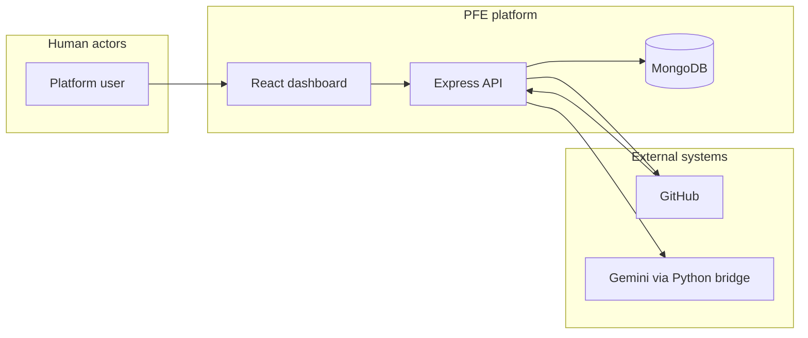

**Figure 1.3: Iterative and incremental development phases applied to this project.**

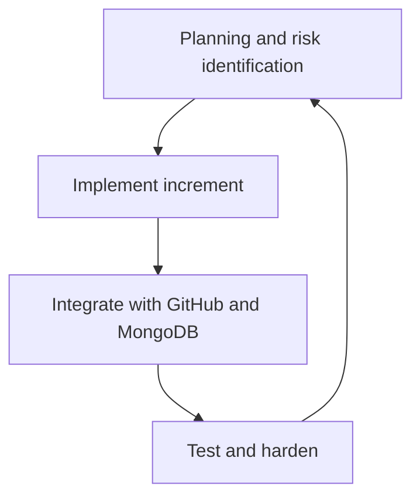

**Illustrative iteration themes** aligned to the codebase:

1. **Webhook correctness:** raw body parsing, **`pull_request`** action filter, **`installationId` fallbacks**, `RepoConfig` upsert race handling (duplicate key retry) in `server.ts`.
2. **Auth hardening:** **JWT** sessions, **bcrypt** password storage, **GitHub OAuth** error HTML, **`requireSession`** forbidding API-key auth on key-minting routes (`middleware.ts`).
3. **Review robustness:** **diff filtering** tests (`filterUnifiedDiffForReview.test.ts`), **GitHub posting strategy** tests (`githubPostingStrategy.test.ts`), Python **timeout** and **retry** backoff.
4. **Operator experience:** **SSE** bus wiring with **`publish`** on installation link and repo-config updates; **dashboard summary** exposing scheduler and AI settings for observability.

## 1.8 Conclusion

Chapter 1 positioned the **PFE review platform** within collaborative software engineering practice, tied the **problem statement** to **scalability**, **consistency**, and **LLM risk**, and surveyed **manual**, **CI**, and **SaaS** alternatives. Section 1.6 summarized the **actual** implementation paths—**Express** routes, **webhook** semantics, **`reviewPullRequest`**, **Mongoose** models, **SSE**, and the optional **bug-scan scheduler**—so that the proposal is falsifiable against the repository. Chapter 2 formalizes **requirements** and **interaction models** using tables and UML-oriented diagrams.

---

<!-- End Chapter 1 (General context) | Start Chapter 2 (Needs identification and specification) -->

# 2 Needs identification and specification

## 2.1 Introduction

Requirements capture **what** the system must do for its users and **constraints** on **how** it does it. In this repository, the **authoritative** sources for functional behavior are the **Express route registrations** under `backend/src/routes/`, the **`server.ts`** webhook handler, **`reviewPullRequest.ts`**, and the **dashboard** composition in **`DashboardApp.tsx`**. This chapter therefore links each requirement to those artifacts so that an examiner can verify claims quickly.

The chapter proceeds as follows: **actors** and their goals (§2.2); a **consolidated functional list** with **traceability** to HTTP endpoints (§2.3 and Table 2.4); **non-functional** constraints inferred from middleware, environment variables, and hard-coded limits (§2.4); **use case** diagrams at global and detailed levels (§2.5–2.6); and **sequence** diagrams with **step tables** for the three dominant flows: webhook review, GitHub OAuth, and repository configuration updates (§2.7).

## 2.2 Actor identification

| Actor | Goals | Interactions with the system | Constraints |
|-------|--------|------------------------------|-------------|
| **Platform user** | Operate a dashboard that reflects **their** GitHub App installations and repositories; tune review policy; read **findings**; optionally register **API keys** when deployment policy requires them. | Uses the **React SPA** with **Bearer JWT** session tokens (from email/password or OAuth) or, for some read/write API calls, a **service API key** that **`requireAuth`** accepts (`middleware.ts`). **Cannot** mint or revoke API keys using a key: **`requireSession`** enforces session-only access on `/api/keys`. | Does **not** administer GitHub Inc.; permissions are limited to repos the **GitHub App** is installed on and APIs called with **installation** token (`getInstallationOctokit`). |
| **GitHub (external system)** | Deliver **webhooks**; complete **OAuth** for users; serve **REST** APIs for repos and PRs. | Calls **`POST /api/webhooks/github`** with **`X-GitHub-Event`** headers; participates in **`/api/auth/github/*`** OAuth redirects; receives **review** and **comment** API calls from Octokit during **`reviewPullRequest`**. | Webhook delivery and API availability subject to **GitHub** uptime and rate limits; signature format **`sha256=`** per GitHub documentation. |

**Secondary stakeholders** (not separate actor types in the diagrams) include **repository authors** who see posted reviews on PRs, and **administrators** who configure environment secrets (`JWT_SECRET`, App keys, `MONGO_URI`) on the host running Node.

## 2.3 Functional requirements analysis

The following identifiers **FR-xx** consolidate capabilities that the implemented routes already expose. They are **not** a separate specification document—they summarize code behavior.

| ID | Requirement | Evidence in codebase |
|----|-------------|----------------------|
| **FR-01** | **User self-registration** with email and password (minimum **8** characters), optional display name. | `POST /api/auth/register` (`auth.ts`), `User` schema with **`passwordHash`**. |
| **FR-02** | **Email/password login** issuing a **JWT** session. | `POST /api/auth/login`. |
| **FR-03** | **Session introspection** for authenticated clients. | `GET /api/auth/me` with **`requireAuth`**. |
| **FR-04** | **GitHub OAuth browser login** using authorization code flow; scopes **`read:user`** and **`user:email`**. | `GET /api/auth/github/start` (redirect to GitHub), `GET /api/auth/github/callback`; `redirect_uri` from **`OAUTH_CALLBACK_BASE_URL`**. |
| **FR-05** | **Claim GitHub App installations** per user with uniqueness on **`installationId`**; reject cross-account hijack (**409**). | `GET/POST /api/installations`, `DELETE /api/installations/:id`; **`upsertInstallation`**. |
| **FR-06** | **Deep-link** to GitHub’s **new installation** page with signed **`state`**. | `GET /api/github/install`, **`POST /api/github/install-link`** (`installations.ts`), **`signInstallState`**. |
| **FR-07** | **Repository configuration** CRUD: list, create from **`installationId` + `repoFullName`**, patch policy fields, delete. | `/api/repo-configs` router: **GET /**, **GET /available?installationId=**, **POST /**, **PATCH /:id**, **DELETE /:id**. |
| **FR-08** | **Validate** `RepoConfig` inputs: **`focusAreas`** pattern and max **16** tags; **`enforcementLevel`** ∈ {`warning`,`error`}; **`customRules` ≤ 4000** chars; **`mergeMinScore`** clamped **0–100**. | `repoConfigs.ts` sanitizers. |
| **FR-09** | **Automated PR review** on **`pull_request`** **`opened`** / **`synchronize`** after webhook receipt. | `server.ts` + **`reviewPullRequest`**. |
| **FR-10** | **Persist findings** with **visibility** rules merging `userId` match and legacy unmigrated rows for repos the user configures. | `findings.ts`, **`matchFindingsVisibleToUser`**. |
| **FR-11** | **Filter and paginate findings** (`repoFullName`, `prNumber`, `category`, `fileContains`, text **`q`**, **`since`**, **`skip`**, **`limit`** capped at **200**). | `parseFilters` in `findings.ts`. |
| **FR-12** | **Category rollups** for dashboard analytics. | `GET /api/findings/by-category`. |
| **FR-13** | **Operator dashboard summary** with Mongo connectivity, installations, repos, webhook metadata, scheduler env snapshot, AI pipeline notes. | `GET /api/dashboard/summary`. |
| **FR-14** | **SSE stream** of domain events (`installation-linked`, `repo-config-updated`, …) with periodic comment heartbeats. | `GET /api/events`, **`HEARTBEAT_MS = 25_000`**. |
| **FR-15** | **API keys** (hashed at rest) with **revocation**; optional **`REQUIRE_API_KEY_FOR_REVIEWS`** gate in webhook path. | `/api/keys`, **`userHasActiveApiKey`** in `server.ts`. |

**Table 2.4 — Representative HTTP API surface (paths as mounted in `server.ts` and route modules).**

| Path | Typical authentication | Role |
|------|-------------------------|------|
| `POST /api/webhooks/github` | Optional **HMAC** via `GITHUB_WEBHOOK_SECRET` | Ingest GitHub delivery (raw JSON body) |
| `POST /api/auth/register`, `POST /api/auth/login` | None | Account creation and password login |
| `GET /api/auth/me` | `requireAuth` | Current user profile |
| `GET /api/auth/github/start`, `GET /api/auth/github/callback` | None (browser OAuth) | GitHub OAuth |
| `GET /api/installations`, `POST /api/installations`, `DELETE /api/installations/:id` | `requireAuth` | Installation CRUD |
| `GET /api/github/install`, `POST /api/github/install-link` | `requireAuth` | Start GitHub App install flow |
| `GET /api/repo-configs`, `GET /api/repo-configs/available`, `POST /api/repo-configs`, `PATCH /api/repo-configs/:id`, `DELETE /api/repo-configs/:id` | `requireAuth` | Repository configuration |
| `GET /api/findings`, `GET /api/findings/by-category` | `requireAuth` | Findings queries |
| `GET /api/dashboard/summary` | `requireAuth` | Aggregated dashboard JSON |
| `GET /api/events` | `requireAuth` | **SSE** stream |
| `GET /api/keys`, `POST /api/keys`, `DELETE /api/keys/:id` | `requireSession` | API-key lifecycle (session only) |

## 2.4 Non-functional requirements specification

**Security.**

* **Passwords:** never stored plaintext; **`bcryptjs`** hashing on register (`hashPassword`).
* **Sessions:** JWT signed with **`JWT_SECRET`**; error hints reference minimum length when misconfigured.
* **API keys:** random plaintext shown **once** on create; **`keyHash`** and display **`prefix`** stored; revocation sets **`revokedAt`** via `findOneAndUpdate` on **`DELETE /api/keys/:id`**.
* **Webhooks:** when **`GITHUB_WEBHOOK_SECRET`** is set, **`X-Hub-Signature-256`** must match **`verifyGithubSignature256`**; **timing-safe** hex compare. If the secret is **absent**, verification is skipped—acceptable only for trusted local testing.
* **CORS:** **single** allowed origin from **`FRONTEND_BASE_URL`** (trailing slash stripped); **`credentials: false`** in `server.ts`.
* **Multi-tenant isolation:** repository and installation routes scope queries by **`req.user._id`**; **409** if an installation is already owned by another user.

**Performance and scalability.**

* **AI subprocess timeout:** **90 s** per `runPythonReviewOnce` invocation.
* **Diff segmentation:** default **~10k** characters per AI segment (`DIFF_MAX_FOR_AI` in `reviewPullRequest.ts`) and configurable lines per segment (**`DIFF_REVIEW_MAX_LINES_PER_SEGMENT`**, default **400** in code).
* **Burst control:** optional **`AI_REVIEW_SEGMENT_DELAY_MS`** between segments; **`AI_REVIEW_RETRY_MAX`** (default **3**) and exponential-style backoff for retriable Gemini errors (`runPythonReview`).
* **GitHub posting:** multiple **`GITHUB_REVIEW_*`** env vars cap review body, inline comments, and enable **preemptive slim** estimates (`githubPostingStrategy.ts`).

**Reliability and availability.**

* **MongoDB:** application logs missing **`MONGO_URI`**; connection catch logs errors; **`RepoConfig.syncIndexes()`** on startup; **scheduler** **`tick`** returns early if **`mongoose.connection.readyState !== 1`**.
* **Webhook processing:** HTTP **200** **`Webhook received`** is sent **after** signature check **before** heavyweight work—GitHub should not retry while the async path still runs; errors in the async path are **logged** (typical fire-and-forget pattern).

**Usability and observability.**

* **Dashboard summary** exposes **`scheduledBugScan`** snapshot via **`readScheduledScanEnv()`** so operators see interval, caps, and booleans without reading `.env` on disk.
* **HTML error pages** for common OAuth and install-link misconfigurations guide users to fix **`redirect_uri`** or **`GITHUB_APP_SLUG`**.

**Maintainability and portability.**

* **TypeScript** throughout backend; **ES modules** (`"type": "module"`).
* **Modular routers** per concern (`auth`, `installations`, `repoConfigs`, `findings`, `keys`, `dashboard`, `events`).
* **Automated tests** focused on **diff filtering** and **GitHub posting strategy** (`*.test.ts` files)—see Chapter 5.

## 2.5 Functional requirements specification and global use cases

Figure 2.1 aggregates user-visible goals (**FR-01–FR-08**, **FR-10–FR-15**) and the non-human **webhook** path (**FR-09**). The **Platform user** appears on the left; **GitHub** appears as an external actor for **UC6** (delivery) and for OAuth/App install flows that bridge out of the browser.

**Figure 2.1: Global use case diagram — platform user, GitHub, and core services.**

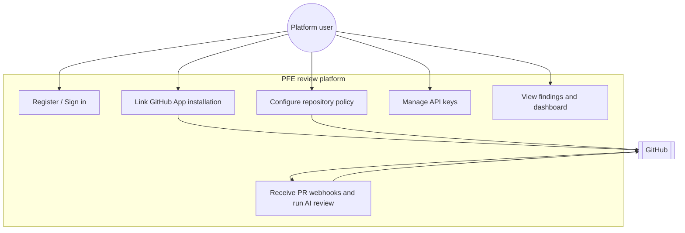

## 2.6 Detailed use case diagrams

Each subsection below refines one **cluster** of the global diagram. They are **not** separate products—they are views on the same code paths already listed in Table 2.4.

### Authenticate

Email/password flows hit **`POST /api/auth/*`** with JSON bodies. GitHub OAuth is **browser-first**: the user agent issues **`GET /api/auth/github/start`**, which **302**-redirects to **`github.com/login/oauth/authorize`** with **`read:user`** and **`user:email`** scopes; **`state`** carries the post-login **`next`** path (must start with `/`). The callback **`GET /api/auth/github/callback`** exchanges the **`code`**, merges **`githubId` / `githubLogin`** into **`User`**, and finally redirects back to the SPA with a token (implementation details in **`auth.ts`**).

**Figure 2.2: Use case diagram — authenticate (email/password or GitHub OAuth).**

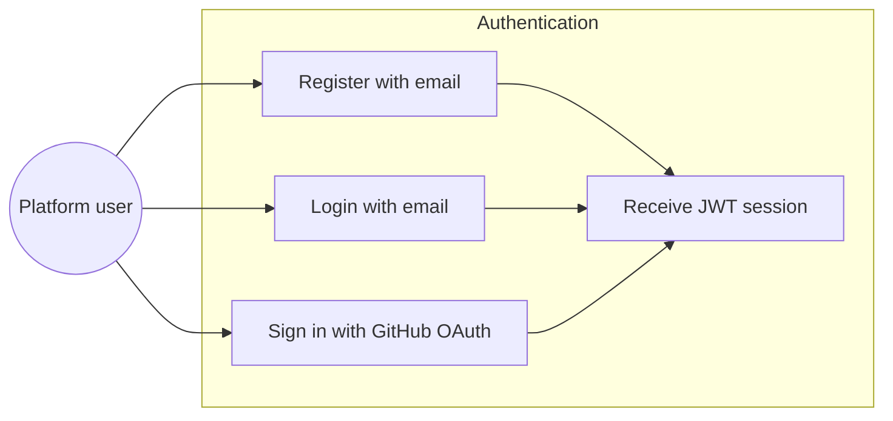

### Link installation

Operators can **list** existing rows (**`GET /api/installations`**), **claim** a numeric installation id discovered after installing the GitHub App (**`POST /api/installations`** body), or **delete** a stale record (**`DELETE /api/installations/:id`** by Mongo **`_id`**). **`POST`** calls **`apps.getInstallation`** to populate **`accountLogin`** / **`accountType`** and emits **`installation-linked`** on the **SSE** bus. First-time install uses **`GET /api/github/install`** (full redirect) or **`POST /api/github/install-link`** (JSON URL for SPA fetch with **Authorization** header).

**Figure 2.3: Use case diagram — link GitHub App installation to the user account.**

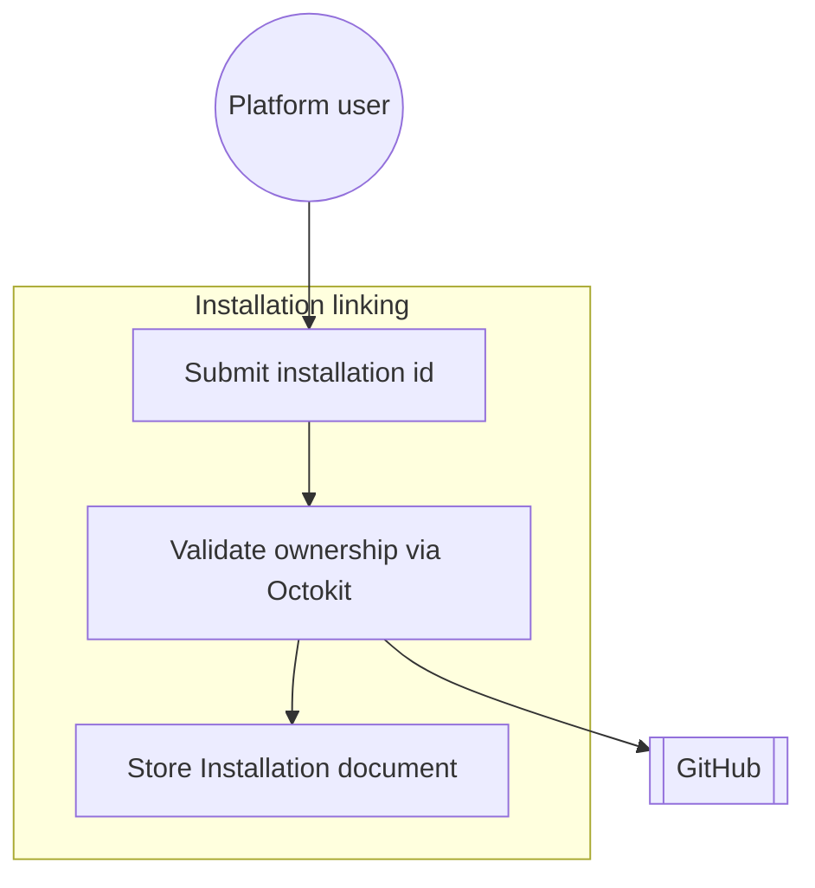

### Configure repository

**`GET /api/repo-configs/available`** uses **`listReposAccessibleToInstallation`** pagination (**100** per page) to enumerate repositories for a validated **`installationId`**. **POST** creates a new **`RepoConfig`** if the pair **`(userId, repoFullName)`** is unique (**409** otherwise). **PATCH** updates whitelisted fields only; **DELETE** removes configuration and publishes **`repo-config-updated`**.

**Figure 2.4: Use case diagram — configure repository review policy.**

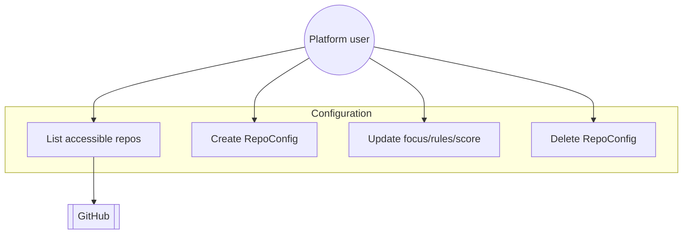

### Automated PR review

This use case is **not** initiated by the Platform user in real time; it is initiated by **GitHub**. The handler validates the **`pull_request`** subset, resolves **tenant** context, optionally enforces **`REQUIRE_API_KEY_FOR_REVIEWS`**, then delegates to **`reviewPullRequest`**, which may **spawn** Python, **write** `PrReviewFinding` documents, and **call** GitHub review APIs.

**Figure 2.5: Use case diagram — automated pull request review (webhook-driven).**

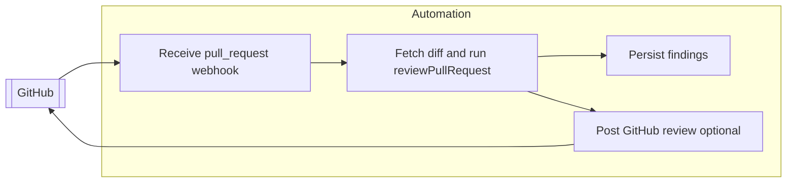

## 2.7 System sequence diagrams

The sequences omit **fine-grained** error branches (e.g. **502** from `listReposAccessibleToInstallation`) but match the **happy paths** exercised during integration testing. Note: the **webhook** path intentionally **acknowledges** quickly to GitHub (**§2.4 Reliability**).

### Webhook review pipeline

**Figure 2.6: Sequence diagram — GitHub webhook to review posting.**

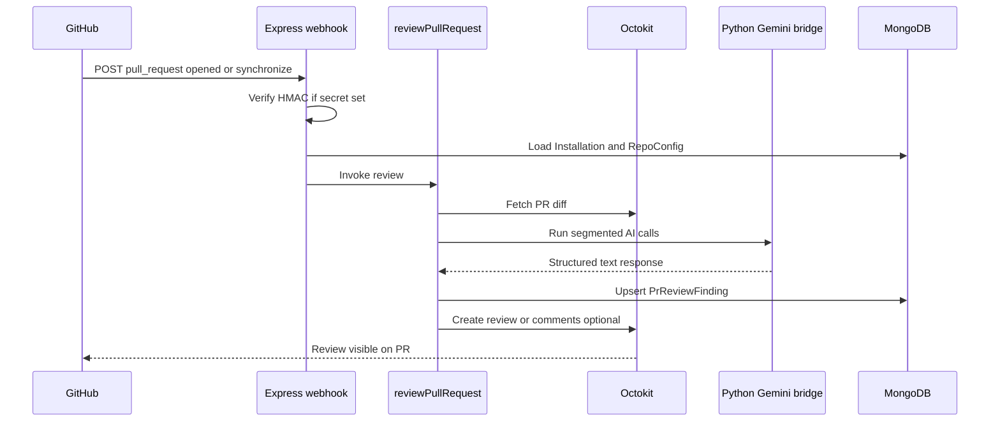

**Table 2.1 — Textual description of the automated PR review (webhook) interaction.**

| Step | Actor / component | Action |
|------|-------------------|--------|
| 1 | GitHub | Delivers JSON **`pull_request`** payload to **`POST /api/webhooks/github`** with headers **`X-Hub-Signature-256`** (when secret configured) and **`X-GitHub-Event`**. |
| 2 | Express | If **`GITHUB_WEBHOOK_SECRET`** is set, verifies **`sha256=`** HMAC over the **raw body**; otherwise skips verification (**development caveat**). |
| 3 | Express | Responds **200** `Webhook received` **before** completing downstream work so GitHub does not treat delivery as failed while the review runs. |
| 4 | Express | Parses JSON; **returns immediately** unless **`x-github-event`** is **`pull_request`**. |
| 5 | Express | Ignores **`action`** values other than **`opened`** or **`synchronize`**. |
| 6 | Express | Extracts **`repository.owner.login`**, **`repository.name`**, **`pull_request.number`**, **`base.sha`**, **`head.sha`**, **`title`**, **`body`**; aborts if required fields missing. |
| 7 | Express | Determines **`installationId`** from payload or **`apps.getRepoInstallation`** fallback. |
| 8 | Express | Loads **`Installation`** by **`installationId`**; **stops** if user has not linked that installation. |
| 9 | Express | If **`REQUIRE_API_KEY_FOR_REVIEWS`**, checks **`userHasActiveApiKey(userId)`**; **stops** when false. |
| 10 | Express | Loads or **upserts** **`RepoConfig`** for **`(userId, repoFullName)`**; aligns **`installationId`** field. |
| 11 | `reviewPullRequest` | Uses **`getEffectiveRepoConfig`**, **installation** Octokit, fetches diff, runs **AI** segments, **upserts** findings, posts GitHub review **subject to strategy**. |

### GitHub OAuth

**Figure 2.7: Sequence diagram — GitHub OAuth sign-in and session establishment.**

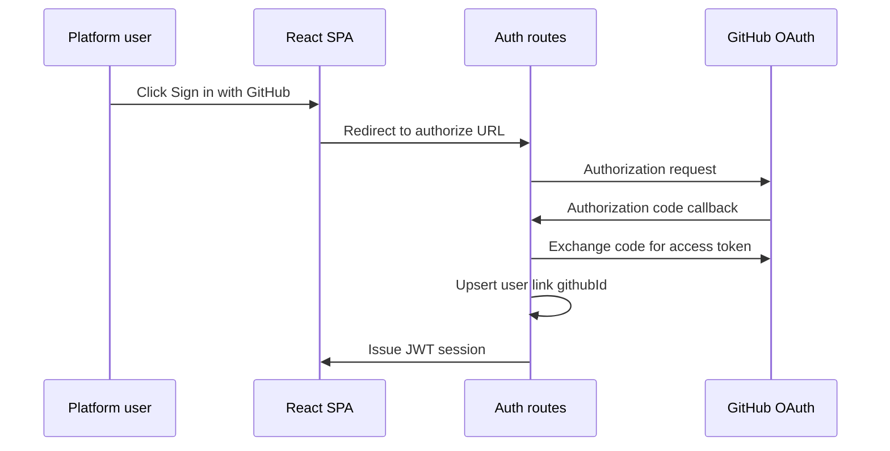

**Table 2.2 — Textual description of the GitHub OAuth sign-in flow.**

| Step | Component | Action |
|------|------------|--------|
| 1 | User / browser | Navigates to **`GET /api/auth/github/start`** (often via full-window redirect from SPA); may pass **`?next=`** path inside **`state`**. |
| 2 | Backend | If **`GITHUB_OAUTH_CLIENT_ID`** missing, returns **503** HTML or JSON with configuration instructions. |
| 3 | Backend | Redirects (**302**) to **`https://github.com/login/oauth/authorize`** with **`redirect_uri`** = **`OAUTH_CALLBACK_BASE_URL`** + **`/api/auth/github/callback`**. |
| 4 | GitHub | Authenticates user; returns **`code`** to **`/api/auth/github/callback`**. |
| 5 | Backend | **`POST`** **`https://github.com/login/oauth/access_token`** with client id/secret and matching **`redirect_uri`**. |
| 6 | Backend | Loads GitHub **user** and **emails**, merges into **`User`** (including **`githubId`**, **`githubLogin`**), calls **`signSession`**, redirects browser to **`FRONTEND_BASE_URL`** (e.g. **`/auth/finish`**) with token—see **`auth.ts`** callback HTML. |

### Repository configuration update

**Figure 2.8: Sequence diagram — update repository configuration from the dashboard.**

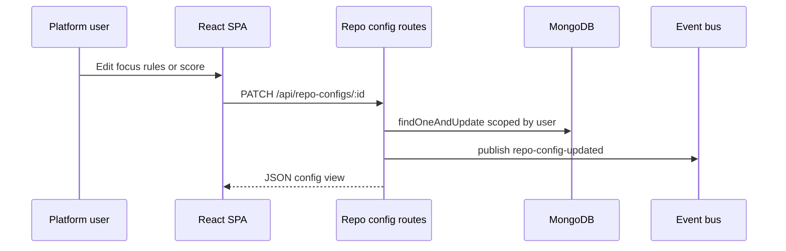

**Table 2.3 — Textual description of the repository configuration update flow.**

| Step | Component | Action |
|------|------------|--------|
| 1 | User | Adjusts **`focusAreas`** (lowercase tags **`^[a-z0-9][a-z0-9_-]{0,31}$`**, max **16**), **`enforcementLevel`**, **`useAstGrep`**, **`customRules`**, or **`mergeMinScore`** in the dashboard. |
| 2 | SPA | Issues **`PATCH /api/repo-configs/:mongoId`** with **`Authorization: Bearer <JWT>`** (or API key where supported by **`requireAuth`**). |
| 3 | Backend | Rejects unknown enforcement values, oversized **`customRules`**, or malformed **`focusAreas`** arrays with **400**. |
| 4 | MongoDB | **`findOneAndUpdate`** with **`_id`** and **`userId`** guard; **404** if not owned. |
| 5 | Event bus | **`publish({ type: 'repo-config-updated', userId, payload })`** notifies **`/api/events`** subscribers. |
| 6 | SPA | Receives updated **`config`** DTO mirroring **`toView`** fields (`installationId`, `repoFullName`, policy columns, ISO timestamps). |

## 2.8 Conclusion

Chapter 2 identified **two primary actors**—the **Platform user** and **GitHub**—and documented **fifteen functional requirements (FR-01–FR-15)** with explicit **traceability** to route paths and models. **Table 2.4** centralizes the **HTTP surface**. Non-functional expectations span **security** (password hashing, JWT, optional webhook HMAC, CORS, tenant isolation), **performance** (AI timeouts, segmentation, retries, GitHub posting caps), **reliability** (Mongo readiness, early webhook acknowledgment), and **maintainability** (router modularity, targeted tests). **Figures 2.1–2.5** and **2.6–2.8**, together with **Tables 2.1–2.3**, supply a bridge from narrative requirements to **Chapter 3**’s conceptual background.

---

# 3 Background and related work

## 3.1 Introduction

This chapter reviews **pull-request workflows**, **human and automated review**, **GitHub integration patterns**, and **LLM-assisted code analysis**, positioning the PFE platform against **commercial** and **open** alternatives without inventing benchmark numbers.

## 3.2 Pull requests and collaborative engineering

**Pull requests** encapsulate proposed changes, discussion, and policy checks before merge. They are the dominant collaboration primitive on GitHub and shape how review automation must behave: **event-driven**, **diff-centric**, and respectful of **branch protection**.

## 3.3 Human code review and automation

Survey literature (e.g. Baccelli and Bird, ICSE 2013) describes modern code review outcomes and challenges. **Automation** complements human judgment with **linters**, **tests**, and increasingly **language models**. The PFE platform treats the model as an **assistant** whose output is **parsed** and **stored**, not as an infallible oracle.

## 3.4 GitHub Apps, OAuth, and webhooks

**GitHub Apps** provide **installation-scoped** credentials and **webhook** subscriptions—ideal for **multi-tenant** linking of customer organizations to a single SaaS deployment pattern. **OAuth** (separate OAuth App) is appropriate for **user identity** in the browser, distinct from **App** credentials (`GITHUB_APP_ID`, private key). Webhook **signatures** (HMAC-SHA256) mitigate forged events [GitHub Docs].

## 3.5 Large language models for code review

LLMs can **summarize diffs** and flag suspected defects but may **hallucinate**. Mitigations in this project include **diff filtering**, **segmentation**, **timeouts**, and **structured response parsing** before posting to GitHub.

## 3.6 Related products and positioning

**Table 3.1 — Qualitative comparison of review assistance categories.**

| Category | Role | Differentiation of PFE stack |
|----------|------|------------------------------|
| Manual review only | Authority and intent | PFE augments, does not replace |
| CI static analysis | Deterministic gates | PFE adds **LLM** narrative; optional `useAstGrep` hook in schema |
| IDE assistants | Authoring time | PFE targets **PR thread** and dashboard |
| Hosted PR bots | Turnkey SaaS | PFE is **transparent** Node/Mongo/Gemini-bridge codebase |

Named competitors or services should be cited from **vendor documentation** in the final bibliography if you make product-specific claims.

## 3.7 Conclusion

The technical backdrop motivates **event-driven** GitHub integration, **installation-aware** multi-tenancy, and **careful** LLM use. Chapter 4 translates these ideas into a concrete **architecture**.

---

# 4 System design and architecture

## 4.1 Introduction

This chapter describes the **deployment context**, **layered architecture**, **data model**, and **major subsystems** implemented under `PFE/backend` and `PFE/frontend`.

## 4.2 Working environment

**Table 4.2 — Primary technology stack (representative versions from package manifests).**

| Layer | Technology |
|-------|------------|
| Runtime | Node.js **>= 22** (backend `engines`) |
| Backend framework | Express **5**, TypeScript |
| Data store | MongoDB with **Mongoose 9** |
| Git integration | **Octokit 5**; GitHub App + OAuth |
| Frontend | React **19**, Vite **8**, React Router **7**, Tailwind **4** |
| AI bridge | Python **3** + `requests` (`pythonExploit.py`) |
| Auth | **JWT** (`jsonwebtoken`), `bcryptjs` |

**Hardware** follows a standard developer or small-server profile: x64/ARM64 host, with network egress to GitHub and to the Gemini endpoint used by the Python script. **Environment variables** (`PORT`, `MONGO_URI`, `JWT_SECRET`, GitHub App and OAuth secrets, optional bug-scan toggles) configure instances.

## 4.3 Logical and physical architecture

**Figure 4.1: Global system architecture (React SPA, Express API, MongoDB, GitHub, Python bridge).**

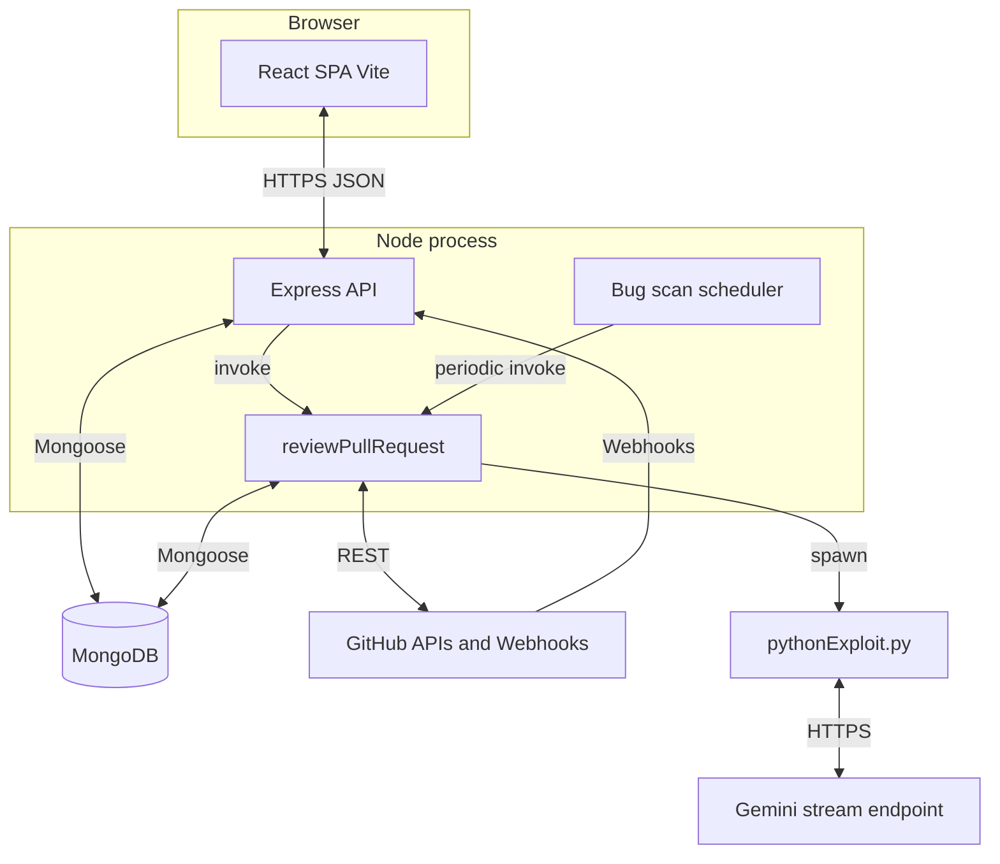

**Figure 4.2: Major backend and frontend component groups.**

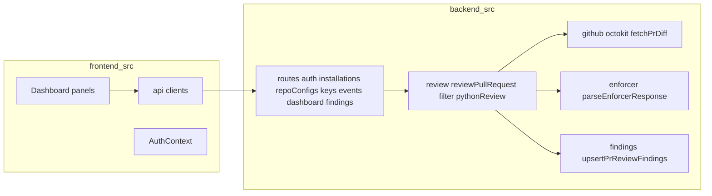

## 4.4 Data design

**Table 4.1 — Main MongoDB collections and their roles.**

| Collection | Principal fields | Role |
|------------|------------------|------|
| `User` | `email`, `passwordHash?`, `githubId?`, `githubLogin?` | Operator identity |
| `Installation` | `userId`, `installationId`, `accountLogin`, `accountType` | GitHub App linkage |
| `RepoConfig` | `userId`, `installationId`, `repoFullName`, `focusAreas`, `enforcementLevel`, `useAstGrep`, `customRules`, `mergeMinScore` | Per-repo AI/review policy |
| `ApiKey` | `userId`, `name`, `prefix`, `keyHash`, `revokedAt?` | Optional gating keys |
| `PrReviewFinding` | `userId?`, `repoFullName`, `prNumber`, `category`, `filePath`, line fields, `description`, `dedupeKey?` | Persisted review items |

Indexes include unique `(userId, repoFullName)` on `RepoConfig` and sparse unique `dedupeKey` on findings.

## 4.5 Key subsystems

* **Webhook subsystem:** `server.ts` mounts raw body parser for signature verification, branches on `x-github-event` and `pull_request` actions.
* **Review subsystem:** composes diff text, enforcer parsing, dedupe keys, GitHub posting strategy.
* **Auth subsystem:** JWT middleware (`requireAuth`, `requireSession`), password hashing, OAuth callback HTML flows.
* **Realtime subsystem:** in-process event bus for SSE (`/api/events`).
* **Scheduler subsystem:** `startBugScanScheduler` invoked on listen when enabled.

## 4.6 Conclusion

The architecture separates **user-facing SPA**, **stateless API** with **MongoDB** persistence, **GitHub** as an external control plane, and a **Python** model bridge. Chapter 5 discusses **implementation artifacts** and **evaluation**.

---

# 5 Implementation and evaluation

## 5.1 Introduction

This chapter outlines **repository structure**, **notable implementation choices**, and **evaluation** grounded in **automated tests** and **manual integration**—without fabricating quantitative LLM benchmarks.

## 5.2 Implementation overview

The repository is split into **`PFE/backend`** (Node service) and **`PFE/frontend`** (Vite SPA). Configuration is environment-driven (`.env.example` template). Production builds compile TypeScript to `dist/` via `tsc`.

**Figure 5.1: High-level mapping of repository directories to responsibilities.**

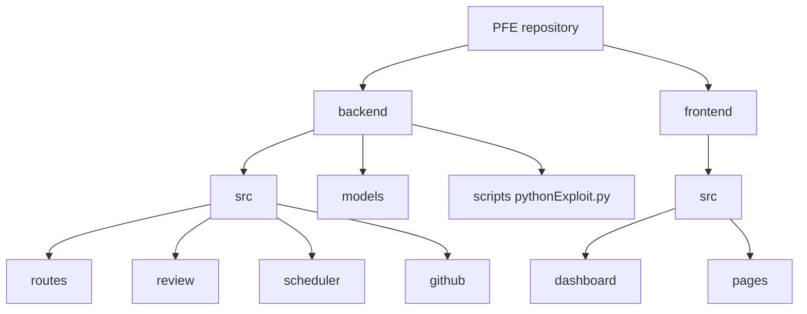

## 5.3 Core modules

* **`reviewPullRequest.ts`:** Orchestrates diff retrieval, AI segmentation, parsing, findings upsert, and GitHub posting with backoff on certain HTTP errors.
* **`pythonReview.ts`:** Spawns configured Python interpreter; enforces subprocess timeout.
* **`filterUnifiedDiffForReview.ts`:** Reduces noise sent to the model (subject to unit tests).
* **`githubPostingStrategy.ts`:** Encapsulates heuristics for slim vs full review payloads (unit-tested).
* **`bugScan.ts`:** Iterates installations and configured repos when scheduler enabled.

## 5.4 User interface

The SPA enforces authentication gates (`RequireAuth`, `DashboardUnlockGate`) before rendering `DashboardApp`. Sections align with operator tasks: linking GitHub, editing configurations, inspecting findings, and managing keys—consistent with `SECTIONS` in `DashboardApp.tsx`.

## 5.5 Evaluation strategy and tests

**Table 5.1 — Automated backend tests identified in the repository.**

| Test file | Focus |
|-----------|--------|
| `src/review/filterUnifiedDiffForReview.test.ts` | Correctness of unified diff filtering for AI review |
| `src/review/githubPostingStrategy.test.ts` | GitHub posting strategy behavior |

Running evaluations: `npm test` in `backend` executes `tsx --test "src/**/*.test.ts"`.

**Manual validation** included end-to-end **pull request** exercise on repositories with the GitHub App installed: webhook delivery, review body presence, findings persistence, and dashboard refresh via SSE events.

## 5.6 Limitations and threats to validity

* **Model dependency:** Gemini availability and policy constraints tied to the **stream bridge** implementation.
* **Security of credentials:** Operators must protect `JWT_SECRET`, GitHub App private key, and webhook secret.
* **Evaluation scope:** No large-scale **empirical defect-detection benchmark** is reported here; quantitative claims would require a labeled dataset and controlled study.

## 5.7 Conclusion

The platform is **implemented** as a modular TypeScript service with a React dashboard and Python model bridge, with **targeted unit tests** and **manual** GitHub validation. The general conclusion synthesizes achievements and future work.

---

# General Conclusion

This work presented the **PFE review platform**, an **AI-assisted**, **GitHub-integrated** service for **pull-request** review. The system combines **OAuth-identified operators**, **GitHub App installations**, **webhook-driven** automation, **MongoDB** persistence of **findings**, and a **Python** bridge to **Gemini**, all wrapped in a **React** dashboard for observability and configuration.

**Contributions** include a **transparent** engineering articulation of event-driven review, **structured** persistence of model outputs, and **operational** mitigations for **rate limits** and **payload size**.

**Future work** may encompass migration to an **official** Google Cloud Gemini API client, deeper **AST-grep** or static-analysis fusion, richer **metrics** on review utility, and hardened **multi-organization** RBAC if the product widens beyond per-user tenancy.

---

# Bibliography

1. GitHub Docs. *Validating webhook deliveries.* https://docs.github.com/en/webhooks/using-webhooks/validating-webhook-deliveries  
2. GitHub Docs. *About GitHub Apps.* https://docs.github.com/en/apps/overview-of-github-apps/about-github-apps  
3. A. Baccelli and C. Bird. “Expectations, outcomes, and challenges of modern code review.” In *Proceedings of the 35th International Conference on Software Engineering (ICSE)*, 2013. (Complete per your school’s citation style.)  
4. Mongoose ODM documentation. https://mongoosejs.com/  
5. Octokit documentation. https://github.com/octokit/octokit.js  

---

*End of draft. Replace all bracketed institutional placeholders; export Mermaid figures to vector images if your template requires; update page numbers and regenerate Lists of Figures/Tables in Word.*
